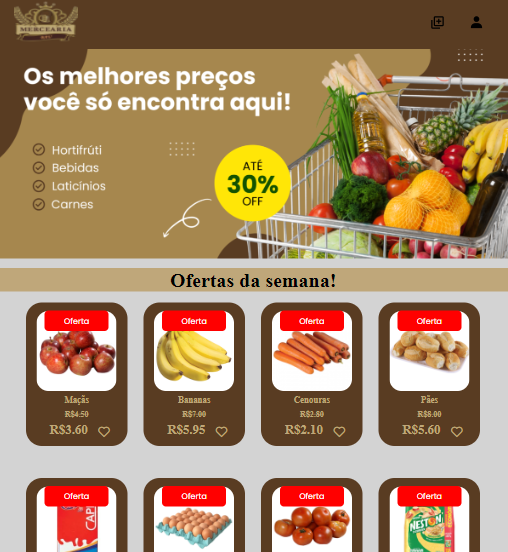

[HTML__BADGE]: https://img.shields.io/badge/Html-000?style=for-the-badge&logo=html
[JAVASCRIPT__BADGE]: https://img.shields.io/badge/Javascript-000?style=for-the-badge&logo=javascript
[CSS__BADGE]:https://img.shields.io/badge/Css-000?style=for-the-badge&logo=css
[PROJECT__BADGE]: https://img.shields.io/badge/📱Visit_this_project-000?style=for-the-badge&logo=project
[PROJECT__URL]:https://github.com/NicolleMP/Mercearia-Bau

<h1 align="center" style="font-weight: bold;">Projeto Mercearia Baú 💻</h1>


![html][HTML__BADGE]
![css][CSS__BADGE]
![javascript][JAVASCRIPT__BADGE]

<p align="center">
 <a href="#about">About</a> • 
 <a href="#started">Getting Started</a> • 
 <a href="#colab">Develop</a> •
 
</p>


<p align="center" >
    
</p>

<h2 id="started">📌 About</h2>
The Mercearia Baú project is a discount club developed for customers of Mercearia Baú, aiming to generate savings on product purchases. It has the following main features:

Login and Registration Screen: Allows users to register and log in to the discount club.

Home Screen: Displays the products on discount, making it easy to view available offers.

Add Products Screen: Restricted to administrators, allows the addition and removal of products and their respective discounts.

This project was developed in the Software Engineering course at university, using the agile Scrum methodology. Trello was used to organize the project and manage the sprints, with daily stand-up meetings to monitor progress.

[![project][PROJECT__BADGE]][PROJECT__URL]

<h2 id="started">🚀 How to run this project?</h2>

First steps to run the project on your machine

<h3>Prerequisites</h3>

Install or have installed the following requirements

- [Git 2](https://git-scm.com/book/pt-br/v2/Come%C3%A7ando-Instalando-o-Git)

<h3>Cloning</h3>

How to clone your project

```bash
git clone https://github.com/NicolleMP/Mercearia-Bau
```

<h3>Starting</h3>

How to start your project

```bash
cd Mercearia-Bau
npm run dev
```

<h2 id="colab">🤝 Developers</h2>

<table>
  <tr>
    <td align="center">
      <a href="#">
        <br>
        <sub>
          <b>Patrick Prestes</b>
        </sub>
      </a>
    </td>
     <td align="center">
      <a href="#">
        <br>
        <sub>
          <b>Nicolle Poltosi</b>
        </sub>
      </a>
    </td>
<table>

